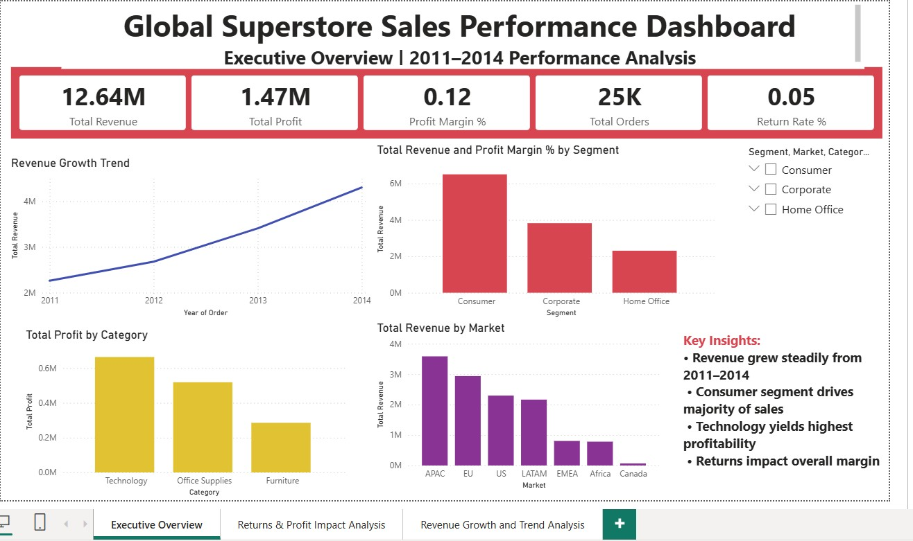
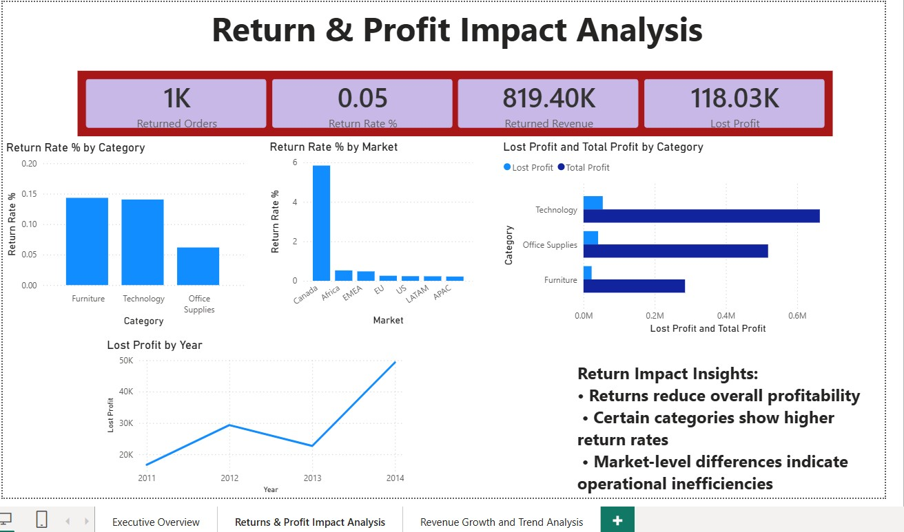
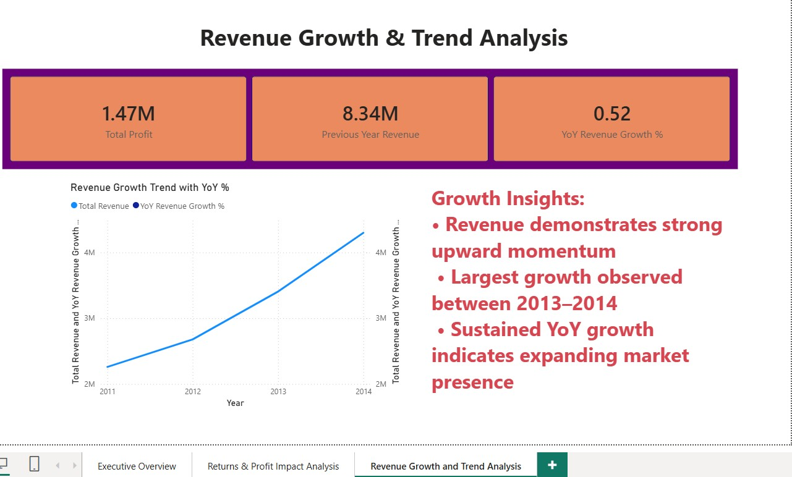

SQL-Analysis-for-Global-Superstore/
│
├── data/
│   └── ECOMM_DATASET.xlsx
│        ├── EComm_Orders.csv
│        ├── EComm_People.csv
│        └── EComm_Returns.csv
│
├── powerbi-dashboard/
│   ├── Global-Superstore-Sales-Analysis.pbix
│   └── dashboard-images/
│       ├── executive-overview.png 
│       ├── returns-analysis.png 
│       └── growth-analysis.png 
│
├── schema.sql
├── data_cleaning.sql
├── analysis_queries.sql
│   ├── kpi_analysis.sql
│   └── advanced_analysis.sql
├── insights.md
└── README.md
